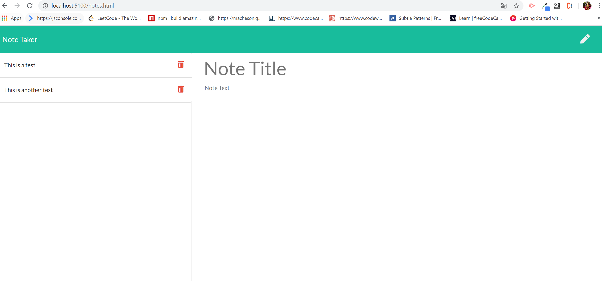

# Note-Taker 
 Homework 11

## Description
This application can be used for writing, saving, and deleting notes. 

## User Story
AS A user, I want to be able to write and save notes
I WANT to be able to delete notes I've written before
SO THAT I can organize my thoughts and keep track of tasks I need to complete

## GitHub Page
https://solka2019.github.io/Note-Taker/.

## Question
When we type the localhost port number, the pages load correctly (static - we type /index.htm and notes.html), however, when I copy the whole page "io" address and just paste that address, the second page (where we type the notes) doesn't load correctly. Do you know why? 
